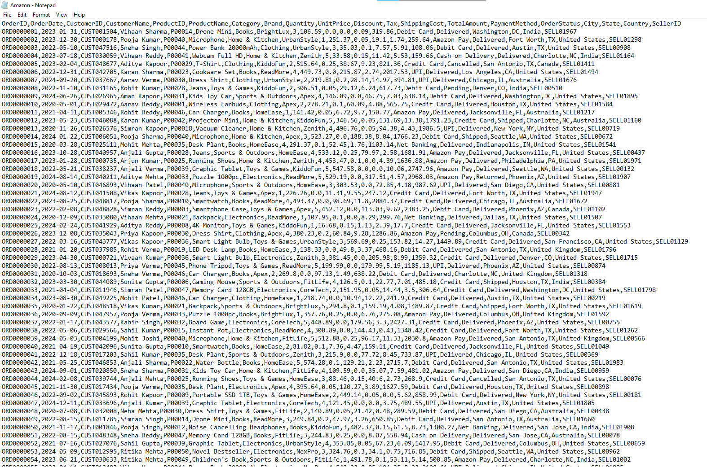
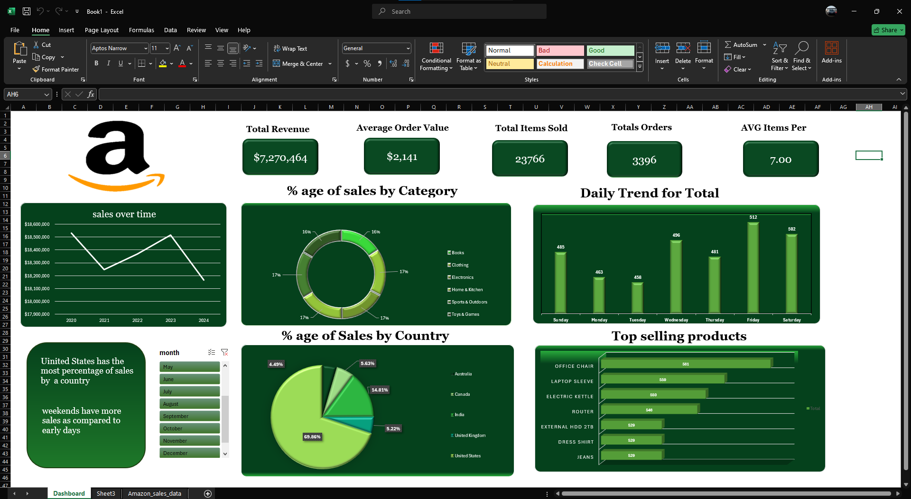

# Amazon-sales-Dashboard
Efficient excel dashboard telling you insights you need about amazon data
# Amazon Sales Analysis Dashboard — Excel Project

## 📊 Project Overview

This project is an **Amazon Sales Analysis Dashboard built in Microsoft Excel**.

The goal of this project was to transform raw sales data into an interactive and easy-to-understand dashboard that provides insights into revenue, orders, products, categories, countries, and sales trends.

The dashboard was created using **Pivot Tables, Pivot Charts, Excel formulas, slicers, filters, and dashboard formatting techniques**.

---

## 🎯 Objectives

The main objectives of this project were:

- Analyze overall sales performance
- Track sales trends over time
- Analyze sales by product category
- Compare sales performance by country
- Identify top-selling products
- Analyze orders by day of the week
- Create an interactive Excel dashboard
- Practice data analysis and visualization skills

---

## 🖥️ Sales Data Preview



---

## 🛠️ Tools & Excel Features Used

### Microsoft Excel

The following Excel features were used in this project:

- Pivot Tables
- Pivot Charts
- Slicers
- Filters
- Excel formulas
- KPI cards
- Data cleaning
- Data aggregation
- Conditional formatting
- Dashboard design
- Data visualization

---

## 📌 Key Performance Indicators (KPIs)

The dashboard includes the following important metrics:

| KPI | Description |
|---|---|
| **Total Revenue** | Total revenue generated from sales |
| **Average Order Value** | Average revenue generated per order |
| **Total Items Sold** | Total number of items sold |
| **Total Orders** | Total number of orders |
| **Average Items Per Order** | Average number of items in each order |

---

## 📈 Dashboard Visualizations

The dashboard contains several visualizations created using Pivot Tables and Charts.

### 1. Sales Over Time

A line chart was used to analyze how sales changed over the years and identify overall sales trends.

### 2. Sales by Category

A doughnut chart shows the percentage contribution of different product categories to total sales.

Categories include:

- Books
- Clothing
- Electronics
- Home & Kitchen
- Sports & Outdoors
- Toys & Games

### 3. Daily Order Trend

A column chart compares the number of orders across different days of the week.

### 4. Sales by Country

A pie chart shows the percentage contribution of different countries to total sales.

### 5. Top-Selling Products

A horizontal bar chart highlights the products with the highest number of items sold.

---

## 🎛️ Interactive Dashboard

The dashboard includes a **Month slicer/filter**, allowing users to interact with the dashboard and analyze sales for different months.

This makes the dashboard more useful than a static report because users can explore different portions of the data.

---

## 🖥️ Dashboard Preview



---

## 💡 Key Insights

Some of the insights identified from the dashboard include:

- **The United States has the highest percentage of sales** among the countries analyzed.
- **Friday and Saturday show strong order volumes** compared with several other days.
- The dashboard makes it easy to identify the **top-selling products**.
- Sales are distributed across multiple product categories.
- The month slicer allows users to explore the data for different months.

> Note: Insights may change depending on the selected filters and the underlying dataset.

---

## 🔄 Project Workflow

The project followed this general workflow:

```text
Raw Sales Data
       ↓
Data Cleaning & Preparation
       ↓
Pivot Tables
       ↓
Calculated Metrics / KPIs
       ↓
Pivot Charts
       ↓
Slicers & Filters
       ↓
Dashboard Design
       ↓
Business Insights
